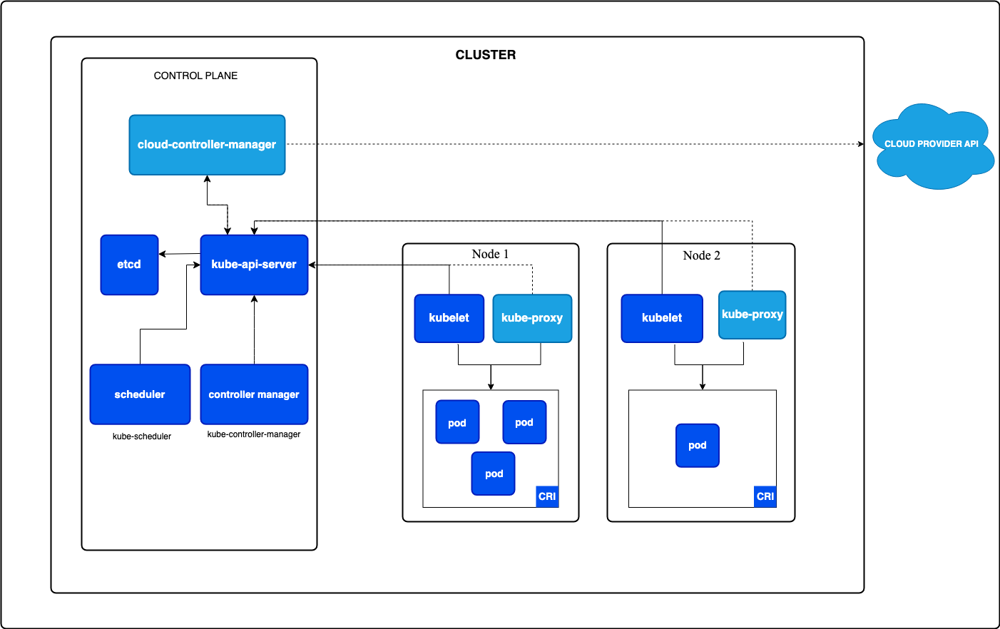

# 000. Как эффективно использовать kubectl

## 🎯 **Как эффективно использовать kubectl**

**kubectl** - основной инструмент для взаимодействия с Kubernetes кластером. Знание продвинутых техник и команд значительно повышает продуктивность работы.

## 🛠️ **Основные категории команд:**

### **1. Resource Management:**
- **get** - получение информации о ресурсах
- **describe** - детальная информация
- **create/apply** - создание ресурсов
- **delete** - удаление ресурсов

### **2. Debugging & Troubleshooting:**
- **logs** - просмотр логов
- **exec** - выполнение команд в контейнерах
- **port-forward** - проброс портов
- **top** - мониторинг ресурсов

### **3. Advanced Operations:**
- **patch** - частичное обновление
- **scale** - масштабирование
- **rollout** - управление развертываниями





01-Основы Kubernetes сделать ссылку 

# 3. Каковы основные компоненты архитектуры Kubernetes?

## 🏗️ **Архитектура Kubernetes**

Kubernetes состоит из **Control Plane** (плоскость управления) и **Worker Nodes** (рабочие узлы).

## ⚙️ **Control Plane (Плоскость управления)**

### **1. API Server (kube-apiserver)**
- **Назначение**: Центральная точка управления кластером
- **Функции**: Обрабатывает REST API запросы, аутентификация, авторизация

### **2. etcd**
- **Назначение**: Распределенная база данных ключ-значение
- **Функции**: Хранит всю конфигурацию и состояние кластера

### **3. Controller Manager (kube-controller-manager)**
- **Назначение**: Запускает контроллеры
- **Функции**: Следит за состоянием ресурсов и приводит их к желаемому состоянию

### **4. Scheduler (kube-scheduler)**
- **Назначение**: Планировщик подов
- **Функции**: Решает, на какой ноде запустить под

## 🔧 **Worker Nodes (Рабочие узлы)**

### **1. kubelet**
- **Назначение**: Агент на каждой ноде
- **Функции**: Управляет подами и контейнерами на ноде

### **2. kube-proxy**
- **Назначение**: Сетевой прокси
- **Функции**: Обеспечивает сетевую связность и балансировку нагрузки

### **3. Container Runtime**
- **Назначение**: Среда выполнения контейнеров
- **Функции**: Запускает и управляет контейнерами (Docker, containerd, CRI-O)

# 4. Что такое Pod в Kubernetes?

## 🎯 **Что такое Pod?**

**Pod** — это наименьшая развертываемая единица в Kubernetes, которая содержит один или несколько тесно связанных контейнеров, разделяющих сеть и хранилище.

## 🏗️ **Ключевые характеристики Pod:**

### **1. Атомарная единица**
- Pod создается и удаляется как единое целое
- Все контейнеры в Pod запускаются на одной ноде
- Pod имеет уникальный IP адрес в кластере

### **2. Разделяемые ресурсы**
- **Сеть**: Все контейнеры используют один IP и порты
- **Хранилище**: Volumes монтируются во все контейнеры
- **Жизненный цикл**: Контейнеры живут и умирают вместе

### **3. Эфемерность**
- Pod может быть пересоздан в любой момент
- IP адрес может измениться при пересоздании
- Данные внутри Pod теряются (если нет Persistent Volumes)

# 8. Что такое Labels и Selectors в Kubernetes?

## 🎯 **Что такое Labels?**

**Labels (Метки)** — это пары ключ-значение, прикрепленные к Kubernetes объектам для их идентификации и группировки.

### **Характеристики Labels:**
- **Произвольные** пары ключ-значение
- **Не уникальные** (много объектов могут иметь одинаковые labels)
- **Используются для организации** и выбора объектов
- **Могут изменяться** во время выполнения

## 🎯 **Что такое Selectors?**

**Selectors (Селекторы)** — это запросы для поиска объектов по их labels.

### **Типы Selectors:**
- **Equality-based**: `app=nginx`, `version!=v1`
- **Set-based**: `environment in (production, qa)`, `tier notin (frontend)`

**Labels и Selectors — это основа организации и управления ресурсами в Kubernetes!**

# 9. Что такое Namespace в Kubernetes?

## 🎯 **Что такое Namespace?**

**Namespace (Пространство имен)** — это виртуальное разделение кластера Kubernetes, которое позволяет изолировать группы ресурсов в одном физическом кластере.

## 🏗️ **Назначение Namespace:**

### **1. Изоляция ресурсов**
- Логическое разделение приложений
- Предотвращение конфликтов имен
- Организация по командам/проектам

### **2. Управление доступом**
- RBAC (Role-Based Access Control)
- Ограничение доступа к ресурсам
- Безопасность на уровне namespace

### **3. Управление ресурсами**
- Resource Quotas (лимиты ресурсов)
- Limit Ranges (ограничения для объектов)
- Network Policies (сетевая изоляция)

# 10. В чем разница между StatefulSet и Deployment?

## 🎯 **Основные различия:**

| Аспект | Deployment | StatefulSet |
|--------|------------|-------------|
| **Назначение** | Stateless приложения | Stateful приложения |
| **Идентичность Pod'ов** | Взаимозаменяемые | Уникальная идентичность |
| **Имена Pod'ов** | Случайные суффиксы | Порядковые номера |
| **Порядок создания** | Параллельное | Последовательное |
| **Хранилище** | Общие volumes | Индивидуальные PVC |
| **Сетевая идентичность** | Нет | Стабильная |
| **Обновления** | Rolling update | Упорядоченное обновление |

## 📦 **Deployment (Развертывание)**

**Deployment** — это ресурс для управления stateless приложениями, где все Pod'ы взаимозаменяемы.

### **Характеристики Deployment:**
- Pod'ы **идентичны** и **взаимозаменяемы**
- **Случайные имена** Pod'ов
- **Параллельное** создание и удаление
- **Общие volumes** (если нужны)
- Подходит для **web серверов**, **API**, **микросервисов**

## 🗄️ **StatefulSet (Состояние)**

**StatefulSet** — это ресурс для управления stateful приложениями, где каждый Pod имеет уникальную идентичность.

### **Характеристики StatefulSet:**
- Pod'ы имеют **уникальную идентичность**
- **Предсказуемые имена** Pod'ов (app-0, app-1, app-2)
- **Последовательное** создание и удаление
- **Индивидуальные PVC** для каждого Pod'а
- Подходит для **баз данных**, **очередей**, **кластерных приложений**

02-Архитектура и компоненты кластера 


# 11. Объясните роль kube-apiserver подробно

## 🎯 **Что такое kube-apiserver?**

**kube-apiserver** — это центральный компонент Control Plane, который предоставляет REST API для всех операций в Kubernetes кластере. Это единственный компонент, который напрямую взаимодействует с etcd.

## 🏗️ **Основные функции kube-apiserver:**

### **1. REST API Gateway**
- Предоставляет единый REST API для всех операций
- Обрабатывает HTTP/HTTPS запросы
- Поддерживает различные форматы (JSON, YAML, Protobuf)

### **2. Аутентификация и авторизация**
- Проверяет подлинность пользователей и сервисов
- Применяет RBAC политики
- Контролирует доступ к ресурсам

### **3. Валидация и мутация**
- Проверяет корректность запросов
- Применяет Admission Controllers
- Модифицирует объекты при необходимости

### **4. Хранение состояния**
- Единственный компонент, работающий с etcd
- Обеспечивает консистентность данных
- Управляет версионированием объектов


# 12. Что такое etcd и почему он критичен для Kubernetes?

## 🎯 **Что такое etcd?**

**etcd** — это распределенная база данных ключ-значение, которая служит единственным источником истины для всего состояния Kubernetes кластера. Это высокодоступное хранилище, использующее алгоритм консенсуса Raft.

## 🏗️ **Почему etcd критичен для Kubernetes:**

### **1. Единственный источник истины**
- Хранит ВСЕ данные кластера
- Конфигурация всех объектов
- Состояние всех ресурсов
- Метаданные и спецификации

### **2. Консистентность данных**
- ACID транзакции
- Strong consistency
- Алгоритм консенсуса Raft
- Защита от split-brain

### **3. High Availability**
- Кластерная архитектура (обычно 3-5 нод)
- Автоматический failover
- Репликация данных
- Устойчивость к сбоям

┌─────────────────────────────────────────────────────────────┐
│                    Digital Ocean Cloud                     │
├─────────────────────────────────────────────────────────────┤
│  etcd Cluster (Managed HA)                                 │
│  ├── etcd-1 (Zone A) - Leader/Follower                     │
│  ├── etcd-2 (Zone B) - Leader/Follower                     │
│  └── etcd-3 (Zone C) - Leader/Follower                     │
│                                                             │
│  Raft Consensus Algorithm                                   │
│  ├── Leader Election                                        │
│  ├── Log Replication                                        │
│  └── Strong Consistency                                     │
├─────────────────────────────────────────────────────────────┤
│  API Server Cluster (HA)                                   │
│  ├── API Server 1 → etcd Client                            │
│  ├── API Server 2 → etcd Client                            │
│  └── API Server 3 → etcd Client                            │
├─────────────────────────────────────────────────────────────┤
│  Stored Data in etcd                                       │
│  ├── All Kubernetes Objects                                │
│  │   ├── Pods, Deployments, Services                       │
│  │   ├── ConfigMaps, Secrets                               │
│  │   └── RBAC, CRDs                                        │
│  ├── Cluster State                                         │
│  │   ├── Node Information                                  │
│  │   ├── Resource Quotas                                   │
│  │   └── Events (TTL)                                      │
│  └── Application Data                                       │
│      ├── ArgoCD Applications                               │
│      ├── Prometheus Configuration                          │
│      └── Ingress Rules                                     │
└─────────────────────────────────────────────────────────────┘
```

**etcd — это фундамент Kubernetes. Без etcd нет кластера!**

# 13. Как работает Kubernetes Scheduler?

## 🎯 **Что такое Kubernetes Scheduler?**

**kube-scheduler** — это компонент Control Plane, который отвечает за размещение Pod'ов на подходящих Node'ах в кластере. Он принимает решения о том, где запустить каждый Pod, основываясь на ресурсах, ограничениях и политиках.

## 🏗️ **Основные функции Scheduler:**

### **1. Планирование Pod'ов**
- Выбирает оптимальную Node для каждого Pod'а
- Учитывает ресурсы (CPU, память, диск)
- Применяет ограничения и предпочтения
- Балансирует нагрузку по кластеру

### **2. Фильтрация Node'ов**
- Исключает неподходящие Node'ы
- Проверяет доступность ресурсов
- Учитывает taints и tolerations
- Применяет node selectors

### **3. Ранжирование Node'ов**
- Оценивает подходящие Node'ы
- Выбирает наилучший вариант
- Оптимизирует распределение
- Минимизирует фрагментацию ресурсов


# 14. Какова роль kubelet?

## 🎯 **Что такое kubelet?**

**kubelet** — это основной агент Node, который работает на каждой Node и отвечает за управление Pod'ами и контейнерами на этой Node. Это связующее звено между Control Plane и рабочими Node'ами.

## 🏗️ **Основные функции kubelet:**

### **1. Управление Pod'ами**
- Получает Pod спецификации от API Server
- Запускает и останавливает контейнеры
- Мониторит состояние Pod'ов
- Отправляет статус обратно в API Server

### **2. Взаимодействие с Container Runtime**
- Использует CRI (Container Runtime Interface)
- Управляет жизненным циклом контейнеров
- Обрабатывает образы контейнеров
- Настраивает сеть и хранилище

### **3. Health Checks**
- Выполняет liveness probes
- Выполняет readiness probes
- Выполняет startup probes
- Перезапускает неисправные контейнеры

### **4. Ресурсы и мониторинг**
- Собирает метрики использования ресурсов
- Управляет cgroups
- Контролирует лимиты ресурсов
- Отправляет метрики в metrics-server


# 15. Что делает kube-proxy?

## 🎯 **Что такое kube-proxy?**

**kube-proxy** — это сетевой компонент, который работает на каждой Node и отвечает за реализацию сетевых правил для Service'ов. Он обеспечивает сетевую связность и load balancing для Pod'ов.

## 🏗️ **Основные функции kube-proxy:**

### **1. Service Discovery**
- Отслеживает Service'ы и Endpoints
- Обновляет сетевые правила при изменениях
- Обеспечивает доступность Service'ов

### **2. Load Balancing**
- Распределяет трафик между Pod'ами
- Поддерживает различные алгоритмы балансировки
- Обрабатывает session affinity

### **3. Network Proxy**
- Перенаправляет трафик к правильным Pod'ам
- Реализует ClusterIP, NodePort, LoadBalancer
- Обрабатывает внешний трафик


```

## 🎯 **Архитектура kube-proxy:**

```
┌─────────────────────────────────────────────────────────────┐
│                    kube-proxy                               │
├─────────────────────────────────────────────────────────────┤
│  Service Watcher                                            │
│  ├── Watch Services from API Server                        │
│  ├── Watch Endpoints from API Server                       │
│  └── Detect changes in real-time                           │
├─────────────────────────────────────────────────────────────┤
│  Proxy Mode                                                 │
│  ├── iptables mode (default)                               │
│  │   ├── Create iptables rules                             │
│  │   ├── DNAT for ClusterIP                               │
│  │   └── Random load balancing                             │
│  ├── IPVS mode                                             │
│  │   ├── Create IPVS rules                                 │
│  │   ├── Multiple LB algorithms                            │
│  │   └── Better performance                                │
│  └── userspace mode (deprecated)                           │
├─────────────────────────────────────────────────────────────┤
│  Network Programming                                        │
│  ├── ClusterIP implementation                              │
│  ├── NodePort implementation                               │
│  ├── LoadBalancer integration                              │
│  └── Session affinity handling                             │
├─────────────────────────────────────────────────────────────┤
│  Health Checking                                            │
│  ├── Monitor backend Pod health                            │
│  ├── Remove unhealthy endpoints                            │
│  └── Update proxy rules                                    │
└─────────────────────────────────────────────────────────────┘
```

## 🔧 **Конфигурация kube-proxy:**

### **1. ConfigMap:**
```bash
# Конфигурация kube-proxy
kubectl get configmap kube-proxy -n kube-system -o yaml

# Основные параметры:
# - mode: iptables/ipvs/userspace
# - clusterCIDR: диапазон IP Pod'ов
# - bindAddress: адрес для привязки
```

### **2. Настройки производительности:**
```bash
# iptables mode настройки
# - masqueradeAll: маскировать весь трафик
# - syncPeriod: период синхронизации правил

# IPVS mode настройки
# - scheduler: алгоритм балансировки (rr, lc, sh)
# - strictARP: строгий ARP режим
```

## 🎯 **Best Practices для kube-proxy:**

### **1. Мониторинг:**
- Следите за метриками kube-proxy
- Мониторьте время синхронизации правил
- Проверяйте доступность Service'ов

### **2. Производительность:**
- Используйте IPVS для больших кластеров
- Оптимизируйте количество Service'ов
- Мониторьте сетевую нагрузку

### **3. Отладка:**
- Проверяйте Endpoints при проблемах
- Анализируйте логи kube-proxy
- Тестируйте сетевую связность

**kube-proxy — это сетевой мост, обеспечивающий доступность Service'ов в кластере!**


# 16. Объясните компоненты Controller Manager

## 🎯 **Что такое Controller Manager?**

**kube-controller-manager** — это компонент Control Plane, который запускает различные контроллеры для поддержания желаемого состояния кластера. Каждый контроллер отвечает за определенный тип ресурсов.

## 🏗️ **Основные контроллеры:**

### **1. Deployment Controller**
- Управляет ReplicaSets
- Обеспечивает rolling updates
- Поддерживает желаемое количество реплик

### **2. ReplicaSet Controller**
- Поддерживает количество Pod'ов
- Создает/удаляет Pod'ы при необходимости
- Мониторит состояние Pod'ов

### **3. Node Controller**
- Мониторит состояние Node'ов
- Обрабатывает Node failures
- Управляет Node lifecycle

### **4. Service Controller**
- Управляет Endpoints
- Обновляет Service discovery
- Интегрируется с cloud providers

### **5. Namespace Controller**
- Управляет жизненным циклом Namespace'ов
- Очищает ресурсы при удалении Namespace


## 🔄 **Control Loop Pattern:**

```
┌─────────────────────────────────────────────────────────────┐
│                    Controller Loop                         │
├─────────────────────────────────────────────────────────────┤
│  1. Watch API Server                                       │
│     ├── Monitor resource changes                           │
│     ├── Get current state                                  │
│     └── Compare with desired state                         │
├─────────────────────────────────────────────────────────────┤
│  2. Reconcile                                              │
│     ├── Calculate diff                                     │
│     ├── Plan actions                                       │
│     └── Execute changes                                    │
├─────────────────────────────────────────────────────────────┤
│  3. Update Status                                          │
│     ├── Report back to API Server                         │
│     ├── Update resource status                             │
│     └── Generate events                                    │
├─────────────────────────────────────────────────────────────┤
│  4. Repeat                                                 │
│     └── Continue monitoring                                │
└─────────────────────────────────────────────────────────────┘
```

# 18. Как Kubernetes обрабатывает leader election?

## 🎯 **Что такое Leader Election?**

**Leader Election** — это механизм выбора единственного активного экземпляра из нескольких реплик компонента для предотвращения конфликтов и обеспечения консистентности.

## 🏗️ **Зачем нужен Leader Election:**

### **1. Предотвращение конфликтов**
- Только один экземпляр выполняет операции
- Избежание race conditions
- Консистентность данных

### **2. High Availability**
- Автоматический failover при сбоях
- Быстрое восстановление
- Непрерывность работы

### **3. Координация работы**
- Синхронизация между репликами
- Распределение задач
- Управление ресурсами


## 🔄 **Механизм Leader Election:**

### **1. Lease-based Leader Election:**
```
┌─────────────────────────────────────────────────────────────┐
│                  Leader Election Process                   │
├─────────────────────────────────────────────────────────────┤
│  1. Candidate Startup                                       │
│     ├── Instance starts up                                 │
│     ├── Attempts to acquire lease                          │
│     └── Becomes leader or follower                         │
├─────────────────────────────────────────────────────────────┤
│  2. Leader Operations                                       │
│     ├── Renews lease periodically                          │
│     ├── Performs active work                               │
│     └── Updates lease timestamp                            │
├─────────────────────────────────────────────────────────────┤
│  3. Follower Monitoring                                     │
│     ├── Watches lease object                               │
│     ├── Waits for lease expiration                         │
│     └── Ready to take over                                 │
├─────────────────────────────────────────────────────────────┤
│  4. Failover                                               │
│     ├── Leader fails to renew lease                        │
│     ├── Lease expires                                      │
│     ├── New leader elected                                 │
│     └── Work continues                                     │
└─────────────────────────────────────────────────────────────┘
```

## 🔄 **Best Practices:**

### **1. Настройка времени:**
- leaseDurationSeconds: 15-30 секунд
- renewDeadline: 10-20 секунд  
- retryPeriod: 2-5 секунд
- Баланс между быстрым failover и стабильностью

### **2. Мониторинг:**
- Отслеживать смены лидера
- Мониторить время failover
- Алерты на частые смены лидера
- Проверять здоровье lease объектов

### **3. Отладка:**
- Анализировать логи контроллеров
- Проверять сетевую связность
- Мониторить производительность API Server
- Проверять ресурсы Node'ов

**Leader Election обеспечивает высокую доступность без конфликтов в распределенной системе!**


